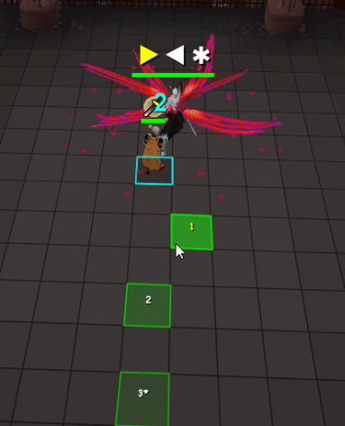

# Drakan Helper

A RuneLite plugin for the final battle of **The Blood Moon Rises** — the fight against **Lord Lowerniel Drakan (Untethered)** on the roof of Castle Drakan.

Drakan Helper reads the fight's real attack data and turns its hardest mechanic — the spear-combo dodge sequence — into a numbered path of click tiles, shown **before the attacks begin**. It also covers the radial AoE ("flare"), both wind-up specials, the Phase 3 vanish/reappear charge, and the fatal Pray-Magic projectiles.


## What it does



### Combo forecast — the full attack chain, in advance

When Drakan winds up a spear combo, he telegraphs each upcoming strike with a red flash. This plugin reads the **complete queued sequence from the client's own data** the moment the wind-up starts:

- **Dodge arrows** above Drakan show the whole chain in screen space — one arrow per strike (`◀`/`▶` = the side to be on, `✱` = the radial AoE slot). Past strikes gray out; the current one is yellow.
- **Numbered safe tiles** paint your exact click path on the ground: each dodge is 2 tiles back in the lane opposite the strike. Numbers are assigned once per combo and never move or renumber; consumed tiles simply vanish.

### The click beat — *when* matters more than *where*

The single most important mechanic in this fight, verified across thousands of logged events: **the dodge is the roll, not the tile.** Drakan auto-hits anyone who is not actively rolling, anywhere in the arena — and clicking a safe tile *early* just walks you onto it to stand and be hit (the wiki hints at this: *"clicking to dodge before that will lead to you taking hits"*).

So the tiles enforce timing: the next tile stays **cold** until the exact moment a click will proc the dodge roll, then flips **hot** with a pulsing yellow outline. One click per flash. The flash timing is tunable to your reaction speed (`Beat delay (ms)`).

### Flare (radial AoE) handling

When a combo contains the radial AoE, its slot is folded into the click path as a `✱` tile — same rhythm, no special-casing needed, because an on-beat roll i-frames the detonation like any other strike. The flare slot is detected **before the AoE telegraph even appears**, from a gap in the flash schedule (see *How it works*).

### Wind-up specials

- **Front/back wave** (spear held at his side): green safe tiles appear at **his flanks** the instant the wind-up starts, with a tick countdown — 4 ticks of warning.
- **Semicircle** (spear held at his chest): safe tiles **directly behind him**, 5 ticks of warning.

His facing locks at the wind-up, so the zones are correct even while his model is still turning.

### Phase 3 vanish / reappear

When Drakan vanishes and reappears, two things can follow:

- **The charge** — he dashes in a straight line at you (~2 tiles/tick). Perpendicular **sidestep tiles** appear on both sides of you with a countdown; running at or away from him keeps you on the line.
- **The blood barrage** — a Pray Magic moment. The plugin distinguishes the two automatically (the barrage announces itself one tick in) and swaps the sidestep tiles for the prayer flash.

### Pray Magic flash

Drakan's blood projectiles (Phase 2 onward) can hit for 80+ — fatal without Protect from Magic. A flashing **PRAY MAGIC** banner fires the moment the projectiles launch, ~2–3 ticks before impact.

## Setup

This is an external (sideloaded) plugin — it is not on the Plugin Hub.

1. **Clone the repo**

   ```
   git clone https://github.com/BrendanJ/drakan-helper.git
   cd drakan-helper
   ```

2. **Run the development client**

   ```
   ./gradlew test --tests DrakanHelperPluginTest
   ```

   or run `DrakanHelperPluginTest` (in `src/test/java`) from your IDE — it launches RuneLite with the plugin loaded. Requires JDK 11.

3. **Enable it** — find **Drakan Helper** in the plugin list and turn it on. Defaults are tuned for the fight; the only knob most players should touch is **Beat delay (ms)** (raise it if the hot flash feels early, lower if late).

> The plugin is display-only: it reads game events and draws overlays. It performs no clicks, no prayers, no automation of any kind.

## Configuration

| Option | Default | What it does |
|---|---|---|
| Safe click tiles | on | The numbered dodge path + click beat |
| Combo dodge forecast | on | The arrow row above Drakan |
| Special-attack safe spots | on | Flank / behind / sidestep tiles with countdowns |
| Pray Magic flash | on | Fatal-projectile warning banner |
| Beat delay (ms) | 250 | Shifts the cold→hot flash to your reaction speed |
| AoE / combo banners, phase HUD, lunge column | off | Legacy/optional extras, off to keep the screen clean |

## How it works

The interesting part, for anyone building fight helpers:

- **The forecast queue.** At combo wind-up, Drakan's actor receives one *spot-anim instance per upcoming strike*, all queued at once with staggered `startCycle` values (one slot ≈ 20 game cycles). The side is encoded in the spot-anim ID (`3910`/`3920` = his left, `3909`/`3919` = his right), and sorting instances by `startCycle` yields the exact strike order. The deprecated single-value `getGraphic()` API cannot see this — you must iterate `getSpotAnims()` and key instances by `(id, startCycle)` so same-side repeats (an `R,R` chain is the same ID twice) are not deduplicated away.
- **Flare slot inference.** The radial AoE's own telegraph (an 8-part spot-anim cluster, `3921–3928`) arrives a tick later than the flashes — but a mid-chain AoE leaves a **double-width gap** in the flash `startCycle` schedule, so the `✱` slot is placed before the cluster ever surfaces and the click path never re-shuffles.
- **The dodge plan** is world-locked: built once per combo (frame derived from the player's bearing — Drakan's own orientation value lags mid-turn), frozen against small shuffles, re-anchored only on real repositioning, failed dodges (hitsplat → immediate correction), or genuine path deviation.
- **Key IDs** (for other tinkerers): boss NPC `16204`; combo wind-up anim `14317` (first strike always +3 ticks); strike anims `14321` (his left) / `14323` (his right); radial AoE `14325`; front/back wave `14327→14329`; semicircle `14333→14335`; vanish/reappear `14313`/`14314`; blood barrage `14311`; fatal projectiles `3874–3879`; player dodge-roll anims `14238`/`14239`.

All of it was derived from tick-level event logs recorded across a dozen real attempts, with every model validated (and several disproven) by replaying the logs through the plugin's exact logic.

## Compliance

Drakan Helper only consumes the RuneLite event bus and renders overlays — comparable to existing boss helpers (Zulrah, Vorkath, etc.). No input automation, no prayer switching, no interaction with the game on the player's behalf.

## Credits

Built by **BrendanJ**, with mechanics reverse-engineering and implementation assistance from Claude (Anthropic). Boss data decoded from recon logs captured during real attempts on the unrepeatable quest fight — and yes, [the fight was won](gfx/gif.gif).
